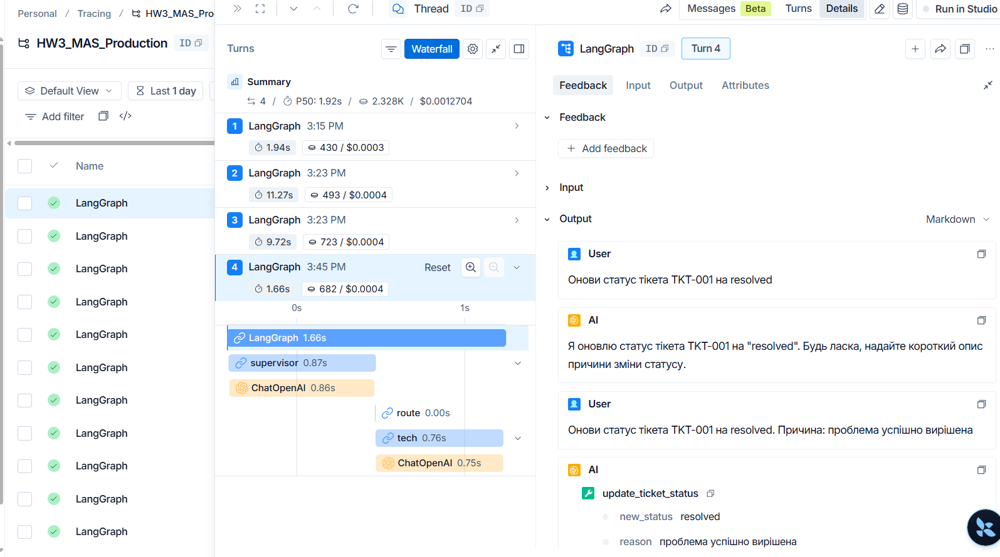

# Фінальне ДЗ №3

Production-ready мультиагентна система для автоматизації служби підтримки клієнтів. Побудована на базі LangGraph із використанням Supervisor-патерну, інтеграцією MCP та чотирирівневою системою захисту Guardrails.

## Архітектура
Система використовує gemini-2.5-flash через OpenRouter та складається з наступних вузлів:
* **Supervisor:** Аналізує намір користувача та маршрутизує запит.
* **Tech Agent:** ReAct-агент для обробки технічних запитів та роботи з тікетами.
* **Billing Agent:** Агент для розрахунку фінансових операцій та повернень.
* **Researcher Agent:** Agentic RAG для пошуку відповідей у базі знань ChromaDB.
* **General Agent:** Fallback-вузол для запитів поза доменом.

Стан графа зберігається за допомогою AsyncSqliteSaver, що дозволяє призупиняти виконання для HITL.

## Model Context Protocol (MCP) Server
MAS підключає ізольований FastMCP сервер `mcp_server.py`, який надає наступні примітиви:
* **Tools:** `get_ticket`, `update_ticket_status` (*ризиковий), `search_tickets`, `get_customer`, `get_summary`.
* **Resources:** `faq://general` (read-only довідник).
* **Prompts:** `support_reply` (шаблон форматування відповідей).

## Захист та Guardrails завдання просунутого рівня
Система реалізує Defense-in-Depth підхід:
1. **Input Guardrail:** Блокує спроби Prompt Injection за допомогою regex-патернів.
2. **Output Guardrail:** Маскує PII дані (email, телефони, номери карток) у вихідних відповідях моделі.
3. **Tool Guardrail:** Обмежує доступ до інструментів на рівні конкретних агентів (Allowlist).
4. **Rate-limit Guardrail:** Обмежує кількість запитів на сесію.
5. **HITL:** Перехоплює ризикову дію `update_ticket_status` за допомогою `interrupt()`, вимагаючи підтвердження (`approve`, `reject`, `edit`) від оператора.

## Observability & Evals завдання експернтого рівня
* **Трасування:** Усі кроки агентів, виклики інструментів та витрати токенів логуються у LangSmith. 
* **Scenario Evals:** Проведено тестування 5 сценаріїв (Pass-rate: 100%). Результати збережено у `eval_results.json`.
* **Red-teaming:** Проведено 5 атак на систему (Prompt Injection, PII Leak, Privilege Escalation). Guardrails успішно заблокували всі вектори атак. Результати у `red_team_results.json`.

## OWASP ASI 2026 Mitigation Matrix

| Guardrail | OWASP ASI | Що захищає | Залишилось немітигованим |
| :--- | :--- | :--- | :--- |
| **Input guardrail** | ASI01 (Agent Goal Hijack) | prompt injection через зовнішні дані (regex) | Складні семантичні атаки, які не покриваються статичним regex |
| **Tool guardrail** | ASI02 (Tool Misuse and Exploitation) | Tool guardrail (allowlist), Pydantic validation | Експлуатація легітимних інструментів з неочікуваними, але валідними параметрами |
| **Tool guardrail** | ASI03 (Identity and Privilege Abuse) | Tool guardrail per-agent + scoped tokens у MCP | Ризик викрадення токена сесії або злам MCP-сервера |
| **System Auth** | ASI04 (Agentic Supply Chain Vulnerabilities) | pip freeze з фіксованими версіями + MCP ізоляція | Вразливості нульового дня у базових бібліотеках (LangGraph) |
| **Architecture** | ASI05 (RCE / Sandbox escape) | MCP server у окремому процесі; жодних eval() у tools | Вразливості контейнеризації або прорив ізоляції на рівні ОС |
| **Output guardrail** | ASI06 (Memory Poisoning) | Output PII redaction + curated KB документи | Непрямий витік даних через аналіз патернів поведінки агента |
| **State Mgt** | ASI07 (Insecure Inter-Agent Communication) | Спільний state у LangGraph (typed) + signed-trace у LangSmith | Перехоплення повідомлень між агентами у розподіленій архітектурі |
| **Rate-limit** | ASI08 (Cascading Failures) | Rate-limit guardrail + timeout | DDoS-атаки на рівні інфраструктури, що обходять application-level ліміти |
| **HITL** | ASI09 (Human-Agent Trust Exploitation) | HITL approval gate для ризикових tools | "Втома від сповіщень" — оператор може автоматично погоджувати дії |
| **Observability** | ASI10 (Rogue Agents) | LangSmith tracing + scenario evals + red-teaming | Автономне створення нових агентів або зміна власного коду |

### Що залишилось немітигованим у прототипі
1. **Семантичні Prompt Injections:** Поточний Input Guardrail базується виключно на регулярних виразах. Досвідчений зловмисник може обійти ці фільтри за допомогою складного перефразування. Для production необхідна інтеграція спеціалізованих LLM-фільтрів.
2. **"Втома" оператора при HITL:** Якщо система генеруватиме забагато запитів на підтвердження, оператор може почати схвалювати їх без належної перевірки (навмання).

## Інструкція із запуску
1. Встановіть залежності: `pip install -r requirements.txt`
2. Налаштуйте ключі у файлі `.env` (OPENROUTER_API_KEY, LANGSMITH_API_KEY).
3. Запустіть тести MCP-сервера: `python test_mcp_server.py`
4. Запустіть головний граф MAS: `python mas_langgraph.py`